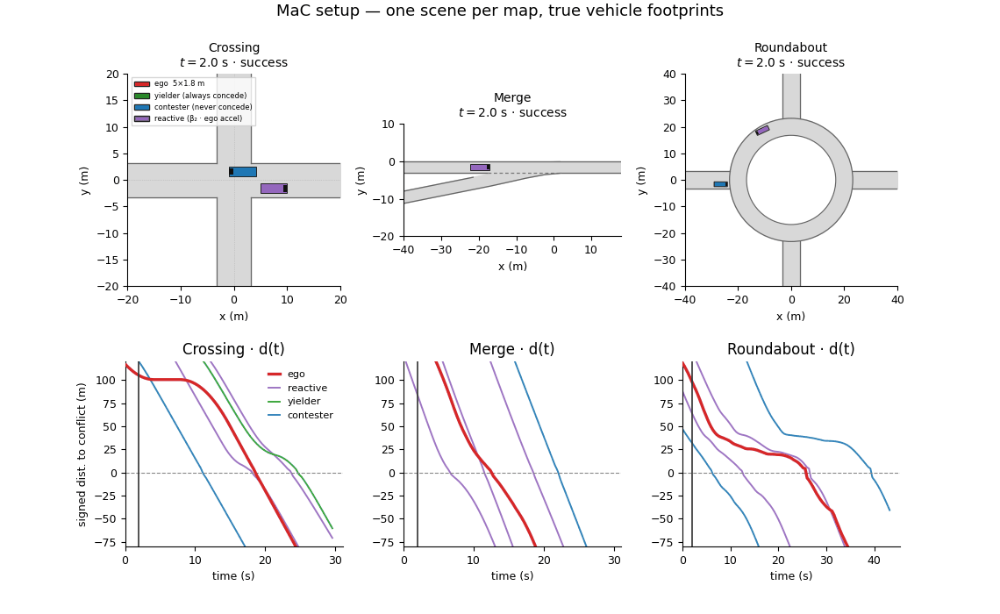

<h1 align="center">Motion as Communication: Plan-Conditioned Diffusion World Models for Negotiation at Unprotected Conflict Points</h1>

<p align="center">
  <a href="https://2026.ieee-iros.org"></a>&nbsp;&nbsp;&nbsp;&nbsp;
  <a href="https://worldmodelworkshop.github.io"></a>&nbsp;&nbsp;&nbsp;&nbsp;
  <a href="LICENSE"></a>
</p>

Interactive driving where the ego’s *planned* motion is treated as a signal: surrounding drivers may yield, contest, or react, and a learned world model predicts how neighbours respond to candidate ego plans. A PPO planner queries that model (and simpler baselines) to choose among yield / hold / assert actions in SUMO scenarios.

<p align="center">
  
</p>

## What’s in this repo

| Path | Role |
|------|------|
| `mac/envs/` | TraCI planning env; social driver types; channel parameters (`β₂`, etc.) |
| `mac/scenarios/` | SUMO nets for **cross**, **merge**, and **roundabout** |
| `mac/models/` | Plan-conditioned diffusion WM + belief / probe features |
| `mac/data/` | Episode collection, normalisation, dataset build |
| `mac/train_*.py`, `mac/eval_*.py` | Training and evaluation entry points |
| `mac/report*.py`, `mac/plot_*.py` | Paper tables and figures from run artefacts |
| `scripts/run_experiments.sh` | End-to-end experiment pipeline |
| `tests/` | Unit tests (normalisation, causal pipeline, branch fidelity) |

Trained weights, datasets, logs, and paper numbers live under `data/` and `logs/` (gitignored). They are produced by the scripts below—nothing in those folders is required to clone and rebuild.

## Requirements

- Python 3.10+ recommended
- [SUMO](https://eclipse.dev/sumo/) on `PATH` (or set `SUMO_HOME`); `traci` / `sumolib` come from the SUMO install
- PyTorch and the packages in `requirements.txt`
- Optional: CUDA GPUs for world-model and planner training

```bash
python -m venv .venv-mac
source .venv-mac/bin/activate   # Windows: .venv-mac\Scripts\activate
pip install -r requirements.txt
# ensure `sumo` runs, e.g. export SUMO_HOME=/usr/share/sumo
```

Scripts default to `PY=.venv-mac/bin/python`. Override with `PY=python` if you use another environment.

## Quick checks

```bash
# Env + rule policies (needs SUMO)
.venv-mac/bin/python -m mac.smoke_test

# Unit tests (no SUMO / no checkpoints)
.venv-mac/bin/python -m unittest discover -s tests -v
```

## Running experiments

Full pipeline (collect → dataset → world models → planners → analysis):

```bash
./scripts/run_experiments.sh --help
NGPU=4 ./scripts/run_experiments.sh all
```

Useful knobs: `SCENES`, `SEEDS`, `ITERS`, `EPOCHS`, `NGPU`, `EPISODES`. Fresh wipe of derived artefacts (keeps raw episodes):

```bash
./scripts/run_experiments.sh wipe
```

Regenerate paper figures after runs:

```bash
./scripts/run_experiments.sh figures
# or: .venv-mac/bin/python -m mac.report --out paper
```

Detailed stage lists, ablations, and wall-clock notes: [`scripts/README_EXPERIMENTS.md`](scripts/README_EXPERIMENTS.md).

## Layout of regenerated artefacts

```
data/mac/
  raw_<scene>/          # collected episodes
  <scene>.npz           # training tensors
  world_model_*.pt      # plan-conditioned / history-only checkpoints
  planner_*/            # per-seed metrics and policies
  wm_eval_*.json        # world-model evaluation
logs/                   # stage stdout
paper/                  # generated tables / figures (optional)
```

## Belief / planner arms

Policies can plan with different neighbour beliefs, including:

- **none** — no world model  
- **geometry** — ego-plan / constant-velocity risk only  
- **kernel** — analytic influence-channel feature  
- **history** — WM without the ego plan  
- **diffusion** — plan-conditioned multi-hypothesis WM  

Comparisons across these arms (and matched no-channel / geometry controls) are how the project separates ordinary risk-aware prediction from using the plan as a communication channel.